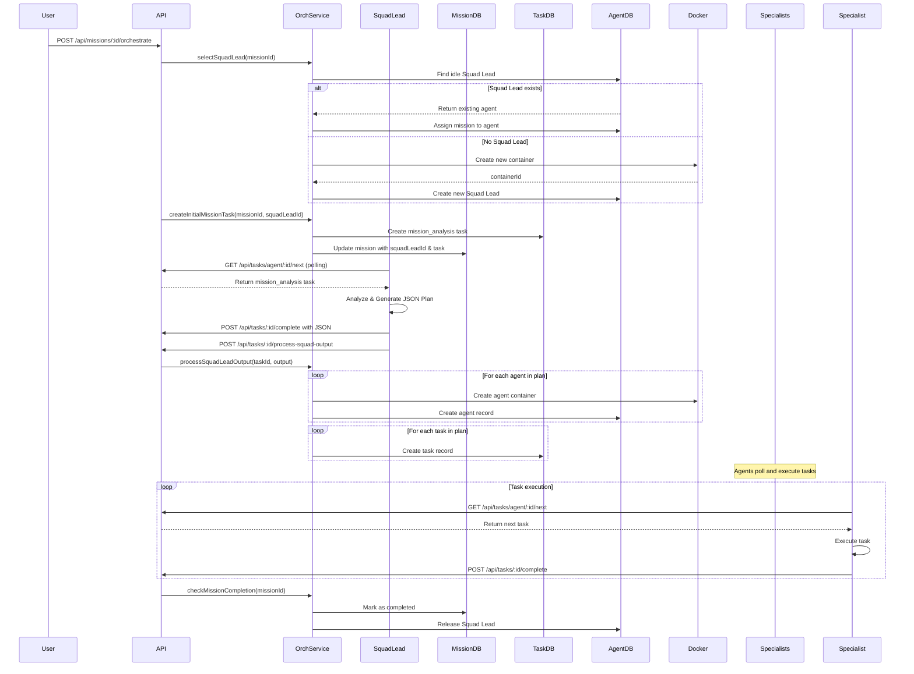

# Squad Lead Orchestration Flow

## Overview

The Squad Lead orchestration flow enables automatic mission planning and execution using a hierarchical agent system. A Squad Lead agent analyzes missions, creates execution plans, and coordinates specialized agents to complete tasks.

## Architecture

```
┌─────────────────────────────────────────────────────────────────┐
│                         HQ System                                │
├─────────────────────────────────────────────────────────────────┤
│                                                                   │
│  ┌──────────────┐     ┌─────────────────┐     ┌─────────────┐ │
│  │   Mission    │────▶│   Squad Lead    │────▶│    Plan     │ │
│  │   (draft)    │     │   (Agent)       │     │   (JSON)    │ │
│  └──────────────┘     └─────────────────┘     └─────────────┘ │
│                               │                                 │
│                               ▼                                 │
│  ┌─────────────────────────────────────────────────────────┐   │
│  │                    Orchestration Service                 │   │
│  │  - Parses Squad Lead output                              │   │
│  │  - Creates specialized agents                            │   │
│  │  - Creates tasks with dependencies                       │   │
│  └─────────────────────────────────────────────────────────┘   │
│                               │                                 │
│                               ▼                                 │
│  ┌─────────────┐  ┌─────────────┐  ┌─────────────┐             │
│  │  Researcher │  │  Developer  │  │   Writer    │   ...       │
│  │   Agent     │  │   Agent     │  │   Agent     │             │
│  └─────────────┘  └─────────────┘  └─────────────┘             │
│         │                │                │                     │
│         └────────────────┴────────────────┘                     │
│                          │                                      │
│                          ▼                                      │
│                   ┌─────────────┐                               │
│                   │    Tasks    │                               │
│                   │  (pending → │                               │
│                   │   completed)│                               │
│                   └─────────────┘                               │
│                          │                                      │
│                          ▼                                      │
│                   ┌─────────────┐                               │
│                   │   Mission   │                               │
│                   │ (completed) │                               │
│                   └─────────────┘                               │
│                                                                   │
└─────────────────────────────────────────────────────────────────┘
```

## Sequence Diagram



## Data Models

### Mission Model Extensions

```typescript
interface Mission {
  // ... existing fields ...

  // Orchestration fields
  squadLeadId?: string              // ID of the Squad Lead agent
  autoOrchestrate: boolean          // Uses auto-orchestration
  initialAnalysisTaskId?: string    // First task for Squad Lead
  orchestrationLog: Array<{
    timestamp: Date
    action: string
    details: Record<string, any>
  }>
}
```

### Agent Model Extensions

```typescript
interface Agent {
  // ... existing fields ...

  // Orchestration fields
  currentMissionId?: string         // Currently assigned mission
  missionHistory: string[]          // Completed mission IDs
  totalMissionsCompleted: number    // Counter
  lastMissionCompletedAt?: Date     // Timestamp
  isReusable: boolean               // Can be reused (default: true)
}
```

### Task Model Extensions

```typescript
type TaskType =
  | 'web_search'
  | 'data_analysis'
  | 'content_generation'
  | 'code_execution'
  | 'custom'
  | 'mission_analysis'   // NEW: Squad Lead analyzes mission
  | 'agent_creation'     // NEW: Create specialized agent
  | 'coordination'       // NEW: Squad Lead coordinates agents
```

## Squad Lead Output Schema

The Squad Lead must respond with a valid JSON plan:

```json
{
  "complexity": "low|medium|high|critical",
  "summary": "Brief summary of the mission",
  "estimatedDuration": 123,
  "tasks": [
    {
      "id": "task-1",
      "title": "Task title",
      "description": "Detailed description",
      "type": "web_search|data_analysis|content_generation|code_execution|custom",
      "dependencies": [],
      "priority": "high|medium|low",
      "estimatedDuration": 45,
      "assignedAgentRole": "researcher|developer|writer|analyst",
      "input": {}
    }
  ],
  "agents": [
    {
      "id": "agent-1",
      "name": "Agent name",
      "role": "researcher|developer|writer|analyst",
      "template": "researcher|developer|writer|analyst",
      "llmModel": "glm-4",
      "capabilities": ["capability1", "capability2"],
      "personality": "Custom personality (optional)"
    }
  ],
  "dependencies": [
    {"taskId": "task-2", "dependsOn": ["task-1"]}
  ],
  "riskFactors": ["potential risk1"],
  "recommendations": ["suggestion1"]
}
```

## API Endpoints

### POST /api/missions/:id/orchestrate

Initiates automatic orchestration for a mission.

**Request:**
```bash
curl -X POST http://localhost:3001/api/missions/{missionId}/orchestrate \
  -H "Authorization: Bearer hq-agent-token"
```

**Response:**
```json
{
  "message": "Mission orchestration started",
  "mission": {
    "_id": "mission-id",
    "title": "Mission Title",
    "status": "active",
    "squadLeadId": "squad-lead-id",
    "autoOrchestrate": true
  },
  "squadLead": {
    "_id": "squad-lead-id",
    "name": "Squad Lead 1234567890",
    "role": "squad_lead",
    "status": "active"
  },
  "initialTask": {
    "_id": "task-id",
    "title": "Analyze Mission and Create Execution Plan",
    "type": "mission_analysis",
    "status": "pending"
  }
}
```

### POST /api/tasks/:id/process-squad-output

Processes the Squad Lead's analysis output and creates agents/tasks.

**Request:**
```bash
curl -X POST http://localhost:3001/api/tasks/{taskId}/process-squad-output \
  -H "Authorization: Bearer hq-agent-token" \
  -H "Content-Type: application/json" \
  -d '{
    "output": {
      "complexity": "high",
      "summary": "Mission summary",
      "estimatedDuration": 120,
      "tasks": [...],
      "agents": [...],
      "dependencies": [...]
    }
  }'
```

**Response:**
```json
{
  "message": "Squad Lead output processed successfully",
  "tasksCreated": 5,
  "agentsCreated": 2
}
```

## Agent Templates

| Template | Role | Capabilities | LLM | Reusable |
|----------|------|--------------|-----|----------|
| squad_lead | squad_lead | mission_analysis, task_planning, agent_coordination, resource_allocation, progress_monitoring | glm-4-plus | Yes |
| researcher | researcher | web_search, data_analysis, information_synthesis, fact_checking, source_evaluation | glm-4 | Yes |
| developer | developer | code_execution, code_review, debugging, code_generation, testing | glm-4 | Yes |
| writer | writer | content_generation, editing, copywriting, documentation, summarization | glm-4 | Yes |
| analyst | analyst | data_analysis, statistics, pattern_recognition, trend_analysis, reporting | glm-4 | Yes |

## Error Handling

### Common Errors

| Error | Cause | Solution |
|-------|-------|----------|
| Mission can only be orchestrated from draft status | Mission already started | Create new mission or reset status |
| Mission already has a Squad Lead assigned | Orchestration already initiated | Check existing orchestration progress |
| Invalid output: tasks array is required | Squad Lead response missing tasks | Check Squad Lead LLM response |
| Could not extract valid JSON from response | JSON parsing failed | Check Squad Lead prompt and LLM output |

### Fault Tolerance

- If an agent creation fails, the orchestration continues with remaining agents
- If a task creation fails, it's logged in `orchestrationLog`
- Failed tasks are marked but don't block other tasks from executing

## Testing

### Manual End-to-End Test

```bash
# 1. Create a mission
MISSION_ID=$(curl -X POST http://localhost:3001/api/missions \
  -H "Authorization: Bearer hq-agent-token" \
  -H "Content-Type: application/json" \
  -d '{
    "title": "Research AI Trends 2024",
    "description": "Comprehensive research on AI trends",
    "objective": "Generate a report on AI trends for 2024",
    "priority": "high"
  }' | jq -r '._id')

echo "Mission ID: $MISSION_ID"

# 2. Start orchestration
curl -X POST http://localhost:3001/api/missions/$MISSION_ID/orchestrate \
  -H "Authorization: Bearer hq-agent-token"

# 3. Check mission status
curl http://localhost:3001/api/missions/$MISSION_ID \
  -H "Authorization: Bearer hq-agent-token" | jq

# 4. Check tasks created
curl "http://localhost:3001/api/tasks?missionId=$MISSION_ID" \
  -H "Authorization: Bearer hq-agent-token" | jq

# 5. Check agents
curl http://localhost:3001/api/agents \
  -H "Authorization: Bearer hq-agent-token" | jq

# 6. Check orchestration log
curl http://localhost:3001/api/missions/$MISSION_ID \
  -H "Authorization: Bearer hq-agent-token" | jq '.orchestrationLog'
```

### Verify in MongoDB

```bash
# Enter MongoDB container
docker exec -it hq-mongodb mongosh -u root -p secret

# Check missions
db.missions.find().pretty()

# Check Squad Lead
db.agents.find({role: 'squad_lead'}).pretty()

# Check mission analysis task
db.tasks.find({type: 'mission_analysis'}).pretty()

# Check orchestration log
db.missions.findOne({autoOrchestrate: true}).orchestrationLog
```

## Important Notes

### String IDs (Not ObjectId)

The system uses String IDs for mission references to avoid "Cast to ObjectId" validation errors:

```typescript
// Agent model
currentMissionId: { type: String }  // NOT Schema.Types.ObjectId
missionHistory: [{ type: String }]

// Mission model
squadLeadId: { type: String }       // NOT Schema.Types.ObjectId
initialAnalysisTaskId: { type: String }
```

### No Populate Calls

String IDs don't support Mongoose `populate()`. Use direct queries:

```typescript
// DON'T do this:
const mission = await Mission.findById(id).populate('squadLeadId')

// DO this instead:
const mission = await Mission.findById(id)
if (mission?.squadLeadId) {
  const squadLead = await Agent.findById(mission.squadLeadId)
}
```

### Agent Reusability

Agents marked with `isReusable: true` can participate in multiple missions:

1. Squad Leads are always reusable
2. After mission completion, they return to `idle` status
3. `currentMissionId` is cleared
4. Mission is added to `missionHistory`

## Orchestration Log

Every orchestration action is logged in `mission.orchestrationLog`:

```typescript
[
  {
    timestamp: ISODate("2024-01-15T10:30:00Z"),
    action: "orchestration_started",
    details: { squadLeadId: "...", squadLeadName: "Squad Lead ..." }
  },
  {
    timestamp: ISODate("2024-01-15T10:31:00Z"),
    action: "squad_lead_output_received",
    details: { complexity: "high", taskCount: 5, agentCount: 2 }
  },
  {
    timestamp: ISODate("2024-01-15T10:32:00Z"),
    action: "agent_created",
    details: { agentId: "...", name: "Researcher", role: "researcher" }
  },
  {
    timestamp: ISODate("2024-01-15T10:33:00Z"),
    action: "task_created",
    details: { taskId: "...", title: "...", type: "web_search" }
  },
  {
    timestamp: ISODate("2024-01-15T14:00:00Z"),
    action: "mission_completed",
    details: { totalTasks: 5, completedTasks: 5, failedTasks: 0 }
  }
]
```

## Future Enhancements

1. **Dynamic Agent Creation**: Allow users to define custom agent templates
2. **Task Retry Logic**: Automatically retry failed tasks with different parameters
3. **Parallel Execution**: Execute independent tasks in parallel
4. **Progress Tracking**: Real-time mission progress updates via WebSocket
5. **Squad Lead Handoff**: Allow multiple Squad Leads for complex missions
6. **Resource Optimization**: Auto-scale agents based on workload
